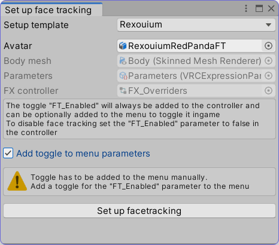

# Simple VRChat Unity Helper Scripts
A collection of simple Unity scripts to automate tedious tasks for creating VRChat Avatars.

**These scripts are not failsafe and don't check for possible errors. Use at your own risk.**

**Source control/Backup your projects before running any of these**

### Requirements
* The VRChat SDK must be imported

### Note
The tools can be found in the "Tools" menu in Unity  


## Copy / Paste Blendshapes as JSON
Copies / Pastes the selected GameObjects skinned mesh renderers blendshapes between avatars

## Apply Clothes
  
Applies the Parent Constraint Component to a cloth item.  
The cloth items Armature bones must have the same hierarchy and must contain the actual bone name in its own name  
  
* Avatar
  * Armature
    * Hips
      * Spine
  * Clothes
    * Armature
      * **FancySocks_Hips** (will parent to Armature/Hips)
        * **FancySocks_Spine** (will parent to Armature/Hips/Spine)

## Create item toggle
  
Creates an item toggle for the selected item.  
  
It will  
* Add the parameter to the VRC Parameter list
* Create Animation Clips with On/Off state
* Add the parameter to the FX Controller
* Create a layer in the FX Controller with the correct states and transitions

**The toggle in the menu itself has to be created manually**

## Fix single key frame animations
Searches all animation clips and add a second keyframe if they only have one.  
This used to be necessary for VRChat and might be no longer needed.

## Set up facetracking
  
Basic setup to automatically create animations for face tracking to be used with [VRCFT Standalone](https://github.com/benaclejames/VRCFaceTracking) based on a template matching [VRCFT Parameters](https://github.com/benaclejames/VRCFaceTracking/wiki/Parameters#lip-tracking-parameters) and model blendshapes  
  
At the [top of the file](Editor/SetupFacetracking.cs#L11) is a template for a lip tracking setup for the [Rexouium](https://rezilloryker.gumroad.com/l/MYutV)  
  
It will  
* Add the parameter to the VRC Parameter list
* Create Animation Clips for each blendshape specified
* Add the parameter to the FX Controller
* Create a layer in the FX Controller with a blendtree

### Examples
```csharp
new TrackingSetup("JawOpen") {
    Single = "MouthOpen"
}
```
Will create the `JawOpen` parameter and create a 1D blendtree animating the `MouthOpen` blendshape from 0 to 1.  
  
```csharp
new TrackingSetup("JawX") {
    Left = "JawLeft",
    Right = "JawRight"
}
```
Will create the `JawX` parameter and create a 1D blendtree animating the `JawLeft` blendshape from -1 to 0 and the `JawRight` blendshape from 0 to 1  
A neutral state with an animation clip with both blendshapes being 0 will be between them.  
  
```csharp
new TrackingSetup("TongueX", "TongueY") {
    Top = "TongueUp",
    TopRight = "TongueUpRight",
    Right = "TongueRight",
    BottomRight = "TongueDownRight",
    Bottom = "TongueDown",
    BottomLeft = "TongueDownLeft",
    Left = "TongueLeft",
    TopLeft = "TongueUpLeft"
}
```
Will create the `TongueX` and `TongueY` parameter and create a 2D blendtree animating the given blendshapes based on their position.  
  
The properties are based on the position on a 2D blendtree  


## Batch upload avatars (SDK 3.3.0 or newer)
Uploads all selected avatars in one go.  
They must have been already uploaded at least once and have a valid blueprint id attached.
